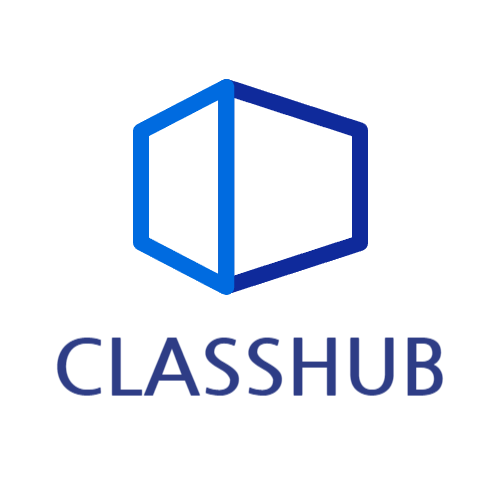

# Classhub \_ 온라인 학습시스템

> ## ✔ 개발인원 , 개발기간 및 역할

    개발인원 : 총 4명 (프론트엔드 1명, 백엔드 3명)

    역할 담당 : 프론트엔드 담당

    개발기간 : 2024.05.01 ~ 2024.06.18

 

> ## ✍ 사용된 기술 스택

### Front-End

 

### ETC

 

> ## 🖐 프로젝트 소개

**클래스허브** 는 언제 어디서나 접근 가능한 온라인 학습 플랫폼으로 다양한 프로그래밍 주제와 전문가 강의를 통해 학생들에게 편리하고 효율적인 학습 경험을 제공합니다.

개발자로 성장하는 과정에서 독학으로 여러 학습 시스템을 활용한 경험이 많은 저는   인프런이나 유데미 등 학습 플랫폼에서 제공되는 영상 이어보기, 학습 현황 추적 기능을 직접 구현해 보고   또한 학습자들과 소통할 수있는 기능과 특히 독학자를 위한 스터디 모집 기능을 구현해보면
좋을 것 같다는 생각이 들어서,  효율적인 학습 환경을 구현해보고자 프로젝트를 기획하게 되었습니다.

 
 

 

<!--  -->

> ## ✨ 프로젝트 핵심 기능

1. 커뮤니티의 질문답변 및 스터디 모집 글 등록, 댓글 등록

2. 강의 영상 이어듣기

3. 강의 장바구니 관리 기능

4. PortOne을 활용한 결제 및 결제내역 조회 기능

5. 사용자의 프로필관리 및 권한 설정
    

> ## ⭐ 프로젝트 기여도

1.  **로그인 JWT토큰을 쿠키로 관리, 유저 정보를 Context API를 통한 전역적 활용**

    - 기존 클라이언트 측에서 Google API 를 사용하여 구글 로그인과 localStorage를 활용한 자동 로그인 기능을 구현
    - 사용자의 고유한 정보 일부분을 localStorage를 통해 자동 로그인을 구현하다 보니 데이터의 위·변조와 같은 보안에 취약하다는 문제점을 인식
    - 백엔드 팀과 조율을 통해 스프링 시큐리티를 도입하여 보안성을 강화하기로 결정
    - 로그인 과정에서 사용자는 백엔드에서 제공한 URL을 통해 로그인 전용 페이지로 이동하여 로그인을 진행하며, 
      로그인 성공 시 백엔드에서 JWT 토큰을 생성하여 브라우저의 쿠키에 저장 이후 메인 페이지로 리다이렉션
    - 성공적으로 쿠키가 발급 된 경우, 쿠키가 저장된 JWT 토큰과  `useEffect` 훅을 사용하여 특정 기능에서 필요한 사용자 정보 일부를 요청
    - 가져온 정보는 `Context API` 를 활용하여 애플리케이션 전역 상태로 관리

2.  **강의 업로드 페이지 구현**

    - 강의 제목, 가격, 설명 등 일반적인 정보들은 useState를 통해 원시 타입으로 관리
    - 영상들은 섹션별로 저장하기위해 객체 배열로 구성
      각 섹션은 객체로 생성하고 영상 부분은 배열로 설정  ( 한 섹션당 영상은 최대 3개 까지 )
    - 영상 추가 시, 상태를 확인할 수 있도록 미리보기 제공
    - 강의 데이터들은 파일 데이터가 포함되어 있기 때문에 FormData 객체로 전달
    - 업로드 시 Content-Type 속성의 경우, 강의의 일반적인 정보들은 JSON 형식으로 전달하고, 
      영상과 이미지 같은 경우 multipart/form-data 형식으로 전달하도록 설정

3.  **PortOne을 활용하여 강의 결제 및 결제내역 조회 구현**

    - 강의 바로 결제 및 장바구니 결제 시, 사전 결제를 먼저 진행한 후 본 결제를 진행
    - 사전 결제의 경우 강의 정보, 금액 정보를 DB로 전달하는 API를 호출하여 결제 정보를 저장
    - 본 결제를 진행하기 전, 사전 결제일과 동일한 결제일 시에만 결제가 진행
    - 결제가 성공적으로 이루어지면 반환 된 주문 번호를 참조하여 결제 내역을 추가 조회하고,
      사용자 화면에 결제가 성공적으로 완료되었음을 알리는 결제 내역을 제공
    - 결제 내역은 주문 번호, 구매자 명, 이메일, 연락처, 결제 여부 및 수단, 카드 번호를 제공

4.  **localStorage를 사용하여 영상 이어듣기 구현**

    - 이어듣기를 구현하기 위해 사용자가 종료하더라도, 데이터를 지속적으로 유지할 필요가 있기 때문에 클라이언트 측에서 영구적으로 데이터를 저장할 수 있는 방법인 localStorage를 선택 
    - React-Player 라이브러리를 활용하여, 특정 상황에 맞게 영상 데이터를 업데이트하도록 설정
    - 영상이 준비되면, 기존 localStorage에서 강의 ID를 Key로 사용하여 저장된 데이터를 확인 후 
      데이터가 존재하는 경우, 영상 재생 시점을 저장된 데이터에 따라 이동
    - 영상이 멈추면, 현재 시점을 localStorage에 강의 ID를 Key로 사용하여 업데이트
    - 사용자가 시청 중 강제 종료되거나 예기치 않은 상황에 대비하여, 일정 시간마다 
      영상의 현재 시점을 localStorage에 자동으로 업데이트

 

> ## 💫 트러블 슈팅

## 커뮤니티 댓글목록 사용자 경험 개선

### [문제점]

커뮤니티 게시글에 댓글을 작성 시 새로고침 시에만 댓글을 확인할 수 있으며, 새로고침 시 화면이 깜빡거리며 사용자 경험이 저하 됨

### [해결 방안]

useState를 통해 UI를 업데이트하고, 후속 작업을 통해 서버에 업데이트가 가능하지만, 
React-Query의 서버 응답에 따른 처리와 데이터 동기화 기능이 동시에 가능한 점을 이용

### [결과]

 - Mutation을 통해 댓글을 작성하게 되면 mutate를 실행 시킨 후, onMutate를 통해 기존 쿼리를 취소하는 `queryClient.cancelQueries`  실행하여, 현재 실행 중인 쿼리를 중단 시키므로 서버 상태와 클라이언트 상태의 충돌을 방지 합니다.
 - 업데이트 중 오류가 발생할 경우를 대비하여 `queryClient.getQueryData` 사용하여 기존 데이터를 백업해 둡니다. 
 - `queryClient.setQueryData` 사용해 서버에 업데이트 되기 전 클라이언트에서 바로 데이터를 업데이트 하여 실시간으로 데이터가 업데이트된 것 처럼보이도록 `Optimistic Update`를 적용하여 UI를 업데이트 합니다.
    
    Optimistic Update : 낙관적 업데이트라고도 불리며, 서버 응답을 기다리지 않고, UI에서 댓글이 바로 업데이트 된 것 처럼 보이도록 합니다.
 - 서버 응답이 반환되면 onSettled 를 호출하여, 해당 쿼리를 무효화하도록 설정하고 서버 데이터와 동기화 시켜 UI를 최신 상태로 유지합니다.
 - 에러가 발생할 때를 대비하여 onError 를 통해, onMutate에서 저장한 백업 데이터를 사용하여 클라이언트 상태를 원래대로 복원할 수 있습니다.

### [느낀점]
댓글 작성 시 새로고침 없이, 댓글 목록 실시간으로 업데이트 되어, 작성한 댓글이 즉각 
반영되는 것을 경험할 수 있었고, 깜빡임도 사라져 사용자 경험을 개선 시킬 수 있었습니다.
또한, Mutation 를 사용함으로써 서버 응답에 따른 처리를 동시에 진행할 수 있었기 때문에 
개발 과정에서 효율성을 향상 시킬 수 있던 점에서 큰 매력을 느끼게 되었습니다.

 
 

## 스프링 시큐리티 추가 및 배포 후 발생한 CORS 문제 해결

### [문제점]

기존 클라이언트 측에서 구현한 자동 로그인 기능이 데이터의 위· 변조 및 보안에 취약하다는 점을 알게 되었고,
이를 개선하기 위해 스프링 시큐리티를 통한 JWT 토큰을 사용하여 배포 작업을 마쳤습니다.
그러나 이전 발생한적이 없던 CORS 에러가 발생하게 되었습니다.

Access-Control-Allow-Origin 에 프론트 도메인이 추가된 상태임에도 에러가 발생

### [중간 소통 및 해결방안]

팀원들과 각자의 개발 환경을 공유하고 현재 문제 상황에 대해 소통하는 과정에서, 백엔드 팀원들이 스프링 시큐리티에 대한 숙련도가 부족하다는 점을 알게 되었습니다. 
이로 인해 문제 발생 지점을 찾는 데 많은 시간이 소요될 것이라고 전달 받았습니다.

프론트엔드 팀원이 1명인 상황에서 많은 작업량을 처리해야 했기에 문제 해결을 기다리기엔 
시간이 부족하였고, 클라이언트 측에서 해결할 방법을 찾던 중 `http-proxy-middleware` 라이브러리를 발견했습니다

`http-proxy-middleware` : 프록시 서버를 쉽게 설정할 수있는 미들웨어
클라이언트 요청을 다른 서버로 중계하여, CORS문제를 우회할 수 있다.
`proxy` : 클라이언트와 서버 사이에 중계 서버를 두어, 클라이언트 요청을 대신 처리하거나 응답하는 역할을 한다.

### [결과]

http-proxy-middleware 라이브러리를 사용하여 배포된 사이트의 URL로 호출하도록 설정하여 일시적으로 CORS에러를 해결한 후 작업을 진행하였습니다.

### [느낀점]

API 의존도가 높은 프로젝트에서 CORS 오류 발생 시 아무 작업을 할 수 없다는 점을 실감하였습니다. 이런 상황을 대비하여 Mock Service Worker 의 필요성을 느꼈고, 
미리 Mock 데이터를 활용하는 방법에 대해 학습해야겠다고 생각하게 되었습니다.

 
 

## 강의 썸네일 및 영상 데이터 처리 이슈 해결 시도와 차선책 구현

### [문제점]

강의 데이터 호출 시, 썸네일 및 영상 데이터가 URL 형태로 제공되었으나, 해당 URL을 참조할 시 데이터가 출력되지 않았습니다.
강의 컴포넌트에서 썸네일이 로드되지 않고, 영상 시청 페이지에서도 영상이 출력되지 않았습니다

### [문제 해결을 위해 시도한 방법]

1. 데이터를 호출하였을 때 전달 받은 데이터 URL을 브라우저 주소창에 입력하여 확인해보았으나 커뮤니티 이미지 데이터는 잘 가져오나, 강의 썸네일 이미지 데이터는 가져오지 못했다.

2. 강의 썸네일을 가져오는 로직을 커뮤니티의 이미지를 불러오는 방식으로 변경해보았지만 데이터를 가져올 수 없었다.

3. 영상 데이터의 경우 react player가 아닌 일반 html 태그인 video 태그도 활용해보았지만 출력이 되지 않았다.

4. 화면 공유를 통해 백엔드 팀과 실시간으로 강의 등록 시 데이터가 제대로 전달되는지 확인해보았다
   데이터는 제대로 전달되는 것으로 확인되었으나, 백엔드에서 Ubuntu에 저장하는 과정에서 문제가 발생하는 것으로 확인되었다.

### [문제 해결 실패]

백엔드 팀과 계속 논의하였으나, 강의 썸네일은 커뮤니티 이미지와 동일한 방식이기 때문에, 저장되고 불러와야 했으나 데이터가 출력되지 않았습니다.
또한, 영상 시청 페이지에서 이어듣기 기능을 구현하기 위해 영상 데이터가 필수였으나, 데이터를 가져올 수 없어 실시간 데이터 동기화 및 이어듣기 기능 구현이 불가능했습니다.

### [결과]

`ubuntu` 저장과정에서 발생하는 문제라 프론트 입장에서 더 이상 도움을 줄 수 있는 방법이 없었다.

차선책으로 프론트엔드 로컬 환경에서 임의의 영상 데이터를 삽입하여, `localStorage`를 통해 
영상 준비시점, 영상 중단시점, 일정시간마다 데이터를 업데이트 하도록 구현하였다.

영상 데이터를 불러와서 실시간으로 영상 정보를 주고받는 기능을 구현하지 못하여 아쉬웠지만,   `localStroage`를 통해서도 이어듣기를 구현할 수 있던 것에 만족하였다.

### [느낀점]

영상 데이터를 실시간으로 주고받는 기능을 구현하지 못해 아쉬움이 있었으나, localStorage를 활용해 이어듣기 기능을 구현할 수 있었던 점에 만족했습니다.
또한, Ubuntu 저장 방식에 대해 이해하고 있었다면 문제를 해결할 수 있었을 것이라는 생각을 하게 되었고, 추후에 기회가 된다면 관련 지식을 더 쌓아야겠다고 생각하게 되었습니다.

 
 

> ## 💡 성과

## 로그인 보안 강화 및 전역 상태 관리 이해
 - localStorage를 활용한 기존 자동 로그인 기능의 보안 취약성을 인지하고, 팀원들과 협력하여 스프링 시큐리티와 JWT 토큰을 도입하여 보안성을 강화했습니다
 - JWT 토큰을 쿠키에 저장하고, Context API를 활용해 유저 정보를 전역 상태로 관리함으로써 보안과 사용자 경험을 동시에 개선했습니다.
 - Context API를 학습하는 과정에서 상태가 변경될 시, 모든 컴포넌트가 다시 렌더링되는 단점을 알게되면서, 상태관리 라이브러리를 사용하는 이유에 대해 이해할 수 있었습니다.
 - 따라서 자주 변경되지 않는 상태를 관리할 때만 사용하거나, 독립적인 상태를 가지며 성능 최적화와 상태 분리 등 많은 기능을 제공하는 상태 관리 라이브러리를 이용하는 것이 좋겠다는 생각이 들었습니다.

## 불필요한 API 호출 최소화 및 사용자 경험 향상
 - React-Query의 Mutation의 Optimistic Update를 활용하여 커뮤니티 댓글 목록의 실시간 업데이트를 구현함으로써, 새로고침 없이도 즉각적으로 반영되는 UI를 제공하였습니다. 
 - 화면 깜빡임 없이 부드럽고 빠른 사용자 경험을 제공할 수 있었으며, 서버와 클라이언트의 데이터 동기화를 통해 최신 데이터를 제공할 수 있었습니다.
 - React-Query를 통해 브라우저 메모리에 데이터를 저장하는 개념인 캐시를 통해, 데이터를 재사용함으로써 불필요한 API를 최소화할 수 있었습니다.

## 팀 협업의 중요성 인식
 - CORS 문제 해결하는 과정에서 팀워크의 중요성을 깨달았습니다. 
 - 스프링 시큐리티를 통한 JWT 토큰 도입 후 CORS 문제를 해결하는 과정에서, 백엔드 팀과의 협업이 필수적이었습니다.
   특히 백엔드 팀이 스프링 시큐리티에 익숙하지 않아 문제 해결에 어려움을 겪었을 때, 팀원들과의 함께 문제 원인 및 임시적인 해결 방안을 찾아내며
   프론트엔드에서 가능한 해결책http-proxy-middleware을 제시해주며 적용한 경험이 팀 협업의 중요성을 깨닫게 해주었습니다.

## 프론트엔드와 백엔드 간의 이해 필요성
 - 강의 데이터 처리 문제에서 Ubuntu 환경과 데이터 저장 방식에 대한 이해 부족으로 문제 해결에  어려움을 겪으며, 
   프론트엔드 개발자도 백엔드 기술과 환경에 대해 어느 정도 이해가 필요하다는 점을 깨달았습니다. 

 

> ## 💭 회고
    해당 프로젝트를 통해 
    TypeScript를 도입하며 코드의 안정성을 높이는 방법과
    
    React-Query를 통해 prefetch, Optimistic Update을 활용하여 사용자 경험을 개선하며
    사용자 중심의 기능 구현에 대한 이해도가 생겼습니다. 
    
    TailwindCSS를 사용하면서 제한된 시간과 인원 속에서 클래스명을 통해 간편하고 신속하게 일관적인 스타일링이 가능한점이 매우 좋았습니다.
    
    JWT 토큰을 통해 로그인 보안을 강화하는 과정에서 보안의 중요성도 알게되었습니다.

    CORS 문제 해결 과정에서 Mock Service Worker의 필요성을 느끼게 되었고, 
    API 오류나 CORS 문제와 같은 상황에서도 개발을 진행할 수 있는 대비책을 마련 해야 한다는 점을 배웠습니다. 

    새로운 기술을 도입하여, 더 나은 사용자 경험을 제공하는 방법을 배우게 되면서 사용자 경험이 얼마나 중요한지 느낄 수 있었습니다.

 

> ## 📷 화면구성
>
> **배포사이트가 없는 관계로 스크린샷과 gif 파일로 대신 첨부합니다**    > _gif 파일이 아닌경우는 화면이 보이지않을 정도로 화질이 좋지않아 사진으로 대체합니다_
## 메인페이지 (Screen)

## pc - 강의 탭, 커뮤니티 탭 (Screen)

 

<!-- 

 -->

## 모바일 버전 - 강의 탭, 커뮤니티 탭, 장바구니 (Screen)

 

 

 

## 커뮤니티 글 작성 조회 및 댓글 (Gif)

## 강의 결제 기능 (Gif)

카카오페이로 결제를 진행하였으나, 카카오 팝업이 녹화되지않아 결제진행 구간은(약 20초) 컷 편집하였습니다.

 
 

